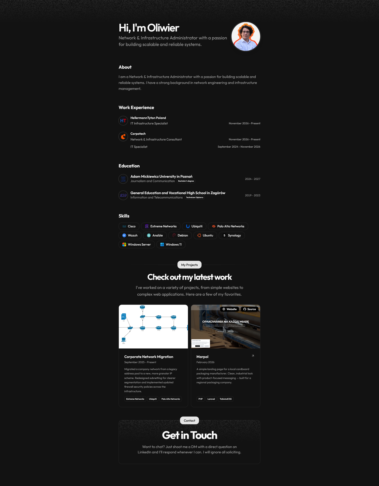

<div align="center">

# Oliwier Drop — Portfolio

Personal portfolio of a **Network & Infrastructure Administrator** — built with Astro on the [Starfolio](https://github.com/webrating/starfolio) template.

[](https://astro.build)
[](https://tailwindcss.com)
[](https://react.dev)

[**oliwierdrop.com**](https://portfolio.oliwierdrop.pl)



</div>

## About

This site showcases my work experience, education, skills, and projects in networking and IT infrastructure (Cisco, Extreme Networks, Ubiquiti, Palo Alto, Windows Server, virtualization, and more). Available in **English** and **Polish**.

Based on [**Starfolio**](https://github.com/webrating/starfolio) by [webrating](https://github.com/webrating) — a modern Astro portfolio starter with Tailwind CSS v4, React islands, and shadcn/ui.

## Stack

- [Astro v6](https://astro.build)
- [React](https://react.dev)
- [Tailwind CSS v4](https://tailwindcss.com)
- [shadcn/ui](https://ui.shadcn.com)
- TypeScript · pnpm

## Quick start

**Prerequisites:** Node.js >= 22.12.0, pnpm

```bash
pnpm install
pnpm dev
```

Open <http://localhost:4321> (`/en` or `/pl`).

## Customization

| File | What it controls |
| --- | --- |
| `src/data/resume.tsx` | EN content — bio, work, education, projects, skills, social |
| `src/data/resume.pl.ts` | PL translations |
| `src/data/config.ts` | Site URL, SEO, theme colors |
| `src/i18n/ui.ts` | UI strings (EN / PL) |

## Commands

| Command | Action |
| --- | --- |
| `pnpm install` | Install dependencies |
| `pnpm dev` | Dev server at `localhost:4321` |
| `pnpm build` | Production build |
| `pnpm preview` | Preview production build |

## Credits

- Template: [webrating/starfolio](https://github.com/webrating/starfolio)
- Inspired by [dillionverma/portfolio](https://github.com/dillionverma/portfolio)
- [Astro](https://astro.build) · [Tailwind CSS](https://tailwindcss.com) · [shadcn/ui](https://ui.shadcn.com)

## License

[MIT](LICENSE)
